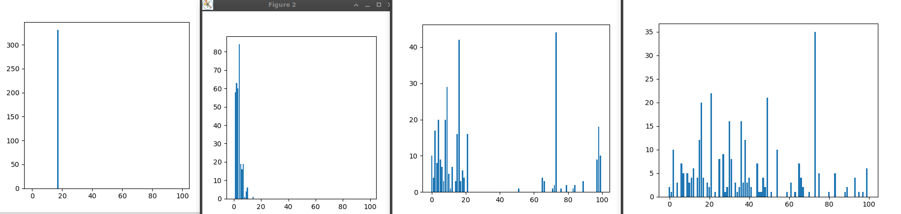

# Работа "Оптимизация хэш-таблицы"

## Цель работы

- Изучить работу хэш-таблиц
- Сравнить различные хэш-функции
- Оптимизировать алгоритм поиска слова в хэш-таблице при помощи AVX инструкций, ассемблерных вставок и ассемблерных функций.

## Теоретическая справка

Хэш-таблица - ...
Хэш-функция - ...

## Часть 1. Исследование хэш-фунцкий.

В первой части работы проводилось исследование эффективности различных функций хэширования.

### Хэш-функции

Для исследования были выбраны нижеперечисленные функции. Они принимают строку символов и возвращают её хеш в виде целочисленного значения.

#### Постоянное значение

 int HashConst(const char* string)
 {
     return CONSTANT_HASH;
 }

#### Длина строки

 int HashLen(const char* string)
 {
     return (int)strlen(string);
 }

#### Первый символ

 int HashFirstSymb(const char* string)
 {
     return (int)string[0];
 }

#### Контрольная сумма

 int HashSum(const char* string)
 {
     int hash = 0;
     size_t len = strlen(string);

     for (int symbol_i = 0; symbol_i < len; symbol_i++)
         hash+=string[symbol_i];

     return hash;
 }

#### Циклический сдвиг влево

 int HashRol(const char* string)
 {
     int hash = 0;
     size_t len = strlen(string);

     for (int symbol_i = 0; symbol_i < len; symbol_i++)
         hash = ROL(hash, 1) ^ string[symbol_i];

     return hash;
 }

#### Циклический сдвиг вправо

 int HashRor(const char* string)
 {
     int hash = 0;
     size_t len = strlen(string);

     for (int symbol_i = 0; symbol_i < len; symbol_i++)
         hash = ROR(hash, 1) ^ string[symbol_i];

     return hash;
 }

#### ... (собственная функция хэширования)

 int MyHash(const char* string)
 {
     int hash = 0, i;
     int rotate = 2;
     int seed = 0x1A4E41U;
     int len = strlen(string);

     for (int i = 0; i < len; i++)
     {
         hash += sTable[(string[i] + i) & 255];
         hash = (hash << (32 - rotate) ) | (hash >> rotate);
         hash = (hash + i) * seed;
     }

   return (hash + len) * seed;
 }

### Методы исследования

Исследование проводилось на массиве неповторяющихся слов. Проводилось заполнение хэш-таблицы значениями при помощи каждой из представленных функций. Затем проанализированы гистограммы заселённости, т.е. количества эдементов в каждом из списков хэш-таблицы, в зависимости от хэш-функции, посчитаны среднеквадратичные отклонения и т.д.

### Результаты измерений

Результаты вы можете видеть на инфографике:

### Выводы

## Часть 2. Оптимизация поиска в хэш-таблице

Для дальнейшей работы была выбрана наиболее эффективная, по результатам первой части работы, хэш-функция ... . Попробуем оптимизировать

### Лимитирующие факторы

### Оптимизация 1: < >

### Оптимизация 2: < >

### Оптимизация 3: < >

### Результаты измерений

### Выводы
