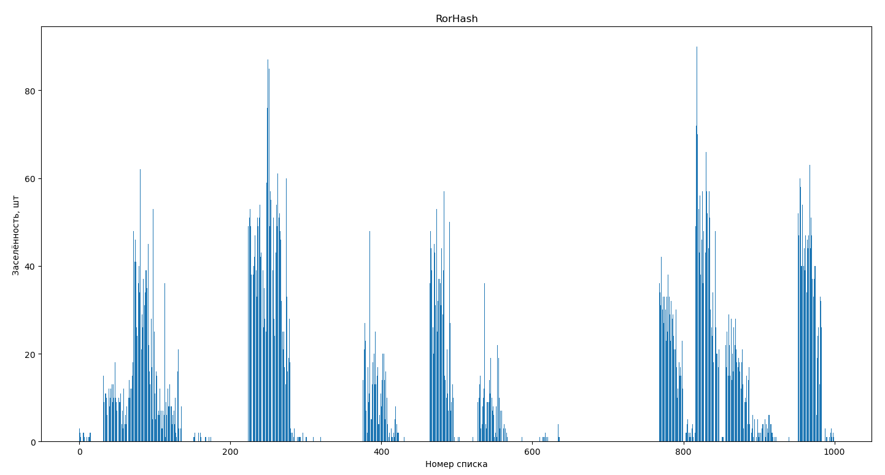
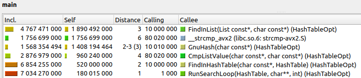
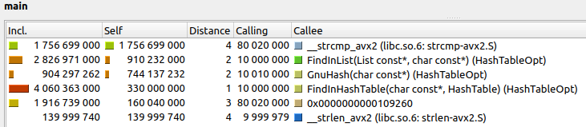
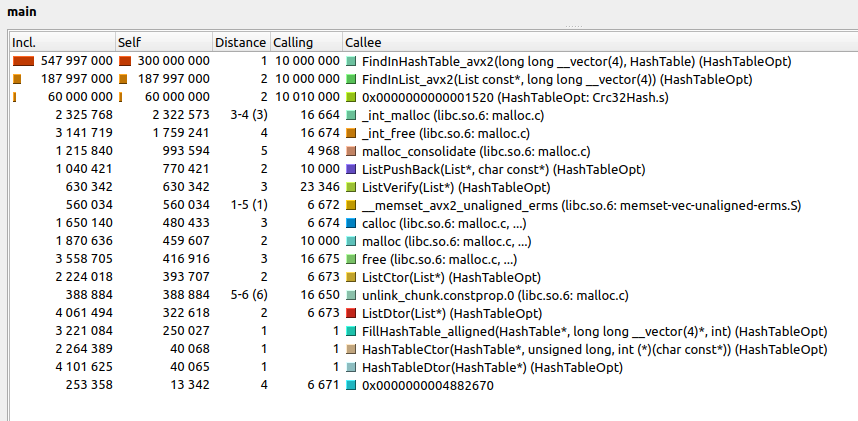

# Работа "Исследование и оптимизация поиска в хеш-таблице"

## Цели работы

- Изучить работу хэш-таблиц
- Сравнить работу различных хэш-функций
- Оптимизировать поиск элементов в хеш-таблице

## Теоретическая справка

**Хэш-функция** - функция, преобразующая входной массив данных в некоторую битовую строку по заданному алгоритму. Такое преобразование называется **хешированием**.

**Хэш-таблица** - структура данных, хранящая пары (ключ, значение), позволяющая выполнять 3 операции: добавление новой пары, удаление пары и поиск по ключу. Существуют 2 основных варианта хеш-таблиц: с открытой адресацией и со списками. В первом случае, таблица является массивом значений ``H``, во втором - массивом списков значений ``H``. К таблице привязана хеш-функция. Перед выполнением любой операции значение хешируется и результат: ``i = hash(key) % sizeof(H)`` является индексом в массиве ``H``. Операция добавления/поиска/удаления значения производится в соответствующей ячейке массива ``H[i]`` или в списке по индексу ``i``, в зависимости от варианта таблицы.

<kbd>
  

</kbd>


**Заселённость** - это число элементов, хранящееся в соотвествующем списке хеш-таблицы, (в реализации таблицы с массивом значений ``H``, заселённость каждой ячейки равна 1 и не имеет смысла).

**Коэффицент заполнения хеш-таблицы (α)** - число хранимых в таблице элементов, делённое на размер массива ``H`` - является важной характеристикой, от которой зависит время выполнения операций. В случае идеальной хеш-функции, равновероятно распределяющей значения по ключам, среднее время работы операции поиска элемента составляет ``Θ(1 + α)``.

## Оборудование и экспериментальная установка

### Машина

Все оптимизации и запуски программы производятся на ноутбуке **HP EliteBook 840 G8 3C6D0ES Evo i5-1135G7**.

### Инструменты

Профилирование программы производится при помощи инструмента ``--callgrind`` утилиты ``valgrind`` и с использованием просмотрщика ``kcachegrind``, а профилирование по времени при помощи библиотеки ``<time.h>``.

*Достойны упоминания*:
- Библиотеки ``re`` и ``random`` языка *Python*¹ используются для лексической обработки входного массива данных и формирования различных выборок данных.
- Библиотеки ``numpy``, ``pandas`` и ``matplotlib`` языка *Python*¹ используются для обработки больших массивов данных и построения графиков.

¹ - запрещён на территории РФ

### Структура данных

Измерения проводятся с хеш-таблицей, содержащей массив структур двухсвязных списков ``lists``, с типом данных ``const char*``:

```C
typedef const char* Value_t;            // тип данных элемента списка

struct HashTable                        // структура хеш-таблицы
{
    size_t n_words;
    size_t size;
    List*  lists;
    int (*hash_function)(const char*);
};
```

К ней также привязана функция хеширования ``hash_function``, чтобы не возникало ошибок добавления, поиска и удаления элементов. Структура ещё содержит размер массива списков ``size`` и суммарное число хранящихся в ней слов ``n_words``.

## Часть 1. Исследование хэш-фунцкий

Первая часть работы посвящена исследованию эффективности различных функций хэширования: от абсолютно неэффективных и бесполезных до часто используемых в алгоритмах хеширования.

### Методика исследования

Измерения проводились на массиве неповторяющихся слов. Для этого был выбран английский словарь², суммарно содержащий около 54000 слов. Его текст был подвергнут лексикографической обработке: при помощи модуля регулярных выражений ``re`` слова разделены, знаки препинания удалены, потворы убраны. Затем, при помощи модуля ``random`` из полученного массива случайным образом выбрано 10000 неповторяющихся слов. После этого хэш-таблица по-очереди заполняется значениями при помощи каждой из исследуемых функций. Производится спектральный анализ: для каждой таблицы я строю гистограмму заселённости, которая визуально отражает равномерность распределения элементов по спискам хеш-таблицы и позволяет оценить эффективность соответствующей хеш-функции.

² - взят с сайта https://www.softmaker.com/ru/dictionaries

### Хэш-функции и их спектральный анализ

Для исследования были выбраны нижеперечисленные функции. Каждая из них принимает на вход строку символов и возвращает её хеш в виде целочисленного значения.

#### ConstHash - постоянное значение

Функция возвращает единственное, ранее определённое значение.

```C
int ConstHash(const char* value)
{
    return CONSTANT_HASH;
}
```

Заселённость хеш-таблицы с ConstHash:

<kbd>
  

</kbd>

Недостатки этой функции очевидны: она никак не распределяет входные данные по спискам и не может быть применена в нашей задаче.

#### LenHash - длина строки

Функция возвращает длину входной строки.

```C
int LenHash(const char* value)
{
    return (int)strlen(value);
}
```

Заселённость хеш-таблицы с LenHash:

<kbd>
  

</kbd>

Функция работают лучше предыдущей, однако на нашем массиве данных она неэффективна из-за лексических особенностей слов: ограниченности их длины, и распределению по длине в английском языке. Так, например, слов длины 7-8 символа в словаре оказалось больше, чем остальных, а слов длиннее 22 символов и вовсе не оказалось (и это будет использовано в части работы с оптимизацией).

#### FirstSymbHash - первый символ

Функция возвращает значение певрвого байта входной строки.

```C
int FirstSymbHash(const char* value)
{
    return (int)value[0];
}
```

Заселённость хеш-таблицы с FirstSymbHash:

<kbd>
  

</kbd>

Распределение, полученное с использованием этой функции оказалось ещё более равномерным, но она всё же не может похвастаться эффективностью по тем же причинам, что и предыдущая, Она также является ограниченной, так как её результат всегда лежит в диапазоне от 0 до 255, к тому же на входном массиве английских слов она может принимать только значения от 65 до 122 (английские буквы от A до z).

#### SumHash - контрольная сумма

Функция возвращает сумму байтов входной строки.

```C
int SumHash(const char* value)
{
    int hash = 0;
    // size_t symbol_i = 0;
    size_t len = strlen(value);

    for (int index = 0; index < len; index++)
        hash += value[index];

    return hash;
}
```

Заселённость хеш-таблицы с SumHash:

<kbd>
  

</kbd>

Функция работает уже сильно лучше, и действительно, контрольная сумма применяется уже гораздо чаще предыдущих хеш-функций, например при передаче данных в сети.

#### RolHash - циклический сдвиг влево

В своём алгоритме функция использует циклический сдвиг влево.

```C
static int ROL(int value, int offset)
{
    return (value << offset) | (value >> (32 - offset));
}

int RolHash(const char* value)
{
    int hash = 0;
    // size_t symbol_i = 0;
    size_t len = strlen(value);

    for (int index = 0; index < len; index++)
        hash = ROL(hash, 1) ^ value[index];
        // hash += 2;

    return hash;
}
```

Заселённость хеш-таблицы с RolHash:

<kbd>
  

</kbd>

Полученное распределение снова заметно лучше предыдущих, эту хеш-функцию уже можно было бы использовать для нашей задачи.

#### RorHash - циклический сдвиг вправо

Функция аналогична предыдущей, но использует в своём алогритме циклический сдвиг вправо.

```C
static inline int ROR(int value, int offset)
{
    return (value >> offset) | (value << (32 - offset));
}

int RorHash(const char* value)
{
    int hash = 0;
    size_t len = strlen(value);

    for (int index = 0; index < len; index++)
        hash = ROR(hash, 1) ^ value[index];

    return hash;
}

```

Заселённость хеш-таблицы с RorHash:

<kbd>
  

</kbd>

Казалось бы, функция похожа на предыдущую и должна давать тоже жостаточно равномерное распределение, однако её эффективность сложно противопоставить RolHash. Это любопытно, но не является предметом данного исследования...

#### GnuHash

Распространённая функция хеширования, похожая на контрольную сумму, но использующая некоторые "магические" числа 33 и 5381 в своём алгоритме.

```C
int GnuHash(const char* value)
{
    int hash = 5381;
    int len = strlen(value);

    for (int index = 0; index < len; index++)
        hash = hash * 33 + value[index];

    return hash;
}
```

Заселённость хеш-таблицы с GnuHash:

<kbd>
  

</kbd>

Функция показала наилучшие результаты на нашем наборе слов, не даром она используется чаще остальных представленных.

### Результаты измерений

Таким образом, различия в приведённых хеш-функциях видны и невооружённым взглядом из гистограмм, однако приведу сравнение некоторых статистических характеристик четырёх наиболее эффективных функций хеширования из нашего набора.

Дисперсия:
<kbd>
  

</kbd>

Стандартное отклонение:
<kbd>
  

</kbd>

Нетрудно видеть, что наименьшие значения дисперсии и стандартного отклонения продемонстрировала функция GnuHash.

### Выводы 1 части

Таким образом, из представленных хеш-фукнций на наборе 10000 случайных слов из английского словаря была выявлена наиболее эффективная функция, и это **GnuHash**. Она показывает наиболее равномерное распределение элементов по спискам. Её и будем использовать во второй части исследования для более эффективной работы хеш-таблицы. Кроме того, в ходе работы стали очевидны явные недостатки FirstSymbHash и SumHash при большом размере хеш-таблицы, а именно, ограниченность этих хеш-функций. Также выявлено неочевидное различие в работе RorHash и RolHash, из которых вторая оказывается менее эффективной в рамках нашей задачи.

## Часть 2. Оптимизация поиска в хэш-таблице

Задача второй части исследования состоит в оптимизации поиска элемента (ключ, значение) в хеш-таблице. Функция поиска принимает на вход ключ, считает его хеш при помощи той же хеш-функции, с которой таблица заполнялась, и проверяет наличие элемента в соответствующем списке. Первая часть исследования обосновывает использование ``GnuHash`` для достижения наибольшей эффективности в работе хеш-таблицы.

### Методика исследования

Сначала появилась идея брать 10000 случайных слов (столько же, сколько хранится в хеш-таблице) из того же 50-тысячного словаря и искать их в построенной ранее хеш-таблице. Однако измерения показывают, что выбранные при помощи модуля ``random`` "случайные" слова из того же полного словаря в этом случае имеют пересечение в около 20% (~1900-2100 слов из 10000) с массивом из первой части работы. В массиве поиска кажется логичным уравновесить число слов, которые есть в таблице, и которых там нет. Для этого я случайным образом выбираю из всего словаря 20000 слов, из которых уже затем два раза выбираю: случайные 10000 слов для заполнения таблицы и случайные 10000 слов для поиска в ней. Измерения показывают, что при этом процент пересечения этих множеств слов составляет около 50% (~4900-5100 из 10000 слов), что, кажется, больше подходит для эксперимента. Работа программы заключается в поиске каждого из слов полученного массива в заполненной хеш-таблице.

### Выявление лимитирующих факторов

Для выяления узких мест программы я пользуюсь утилитой для профилирования ``valgrind --callgrind`` и просмотрщиком ``kcachegrind``. Чтобы увеличить вклад функции поиска элемента в работу программы и при профилировании явно увидеть ресурсы, которые эта функция использует и выявить лимитирующие факторы её работы, я произвожу поиск всех слов из массива поиска в цикле 1000 раз. Для количественного сравнения оптимизированных версий программы я для каждой из версий считаю среднее время прохождения этих тысячи циклов поиска с помощью ``<time.h>``.

### Неоптимизированная версия программы

Измерим время работы неоптимизированной программы и профилируем её.

|Время работы, c        |2.70|
|:----------------------|:--:|

Профиль программы:

<kbd>
  

</kbd>

Граф вызовов:

<kbd>
  

</kbd>

На этих картинках и во всех измерениях далее на скриншотах из просмотрщика ``kcachegrind`` отображены функции, вызываемые внутри ``main``. Кроме того, статистика их вызовов отсортирована по параметру ``self``, чтобы можно было оценить самостоятельный вклад каждой из них в производительность и время работы программы. Отображаемый граф вызовов по умолчанию содержит функции, использующие не менее 5% ресурсов программы, этот формат отображения также удобен для оценки лимитирующих факторов.

### Оптимизация 1: <Флаги компилятора>

Прежде всего, воспользуемся возможностями, которые предоставляет нам компилятор, а именно - используем флаг оптимизации ``-O3``, который показал свою максимальную, по сравнению с другими флагами оптимизации, эффективность в предыдущих проектах³. Кроме того, для уменьшения количества вызовов функций сделаем функции ``RunSearchLoop`` и ``CmpListValue`` типом ``inline``, чтобы компилятор подставил их код в необходимые места программы, при этом не вызывая их, так как это тоже расходует ресурсы машины.

|Время работы, c        |1.80 |
|:----------------------|:---:|
|Относительное ускорение|x1.50|
|Абсолютное ускорение   |x1.50|

Профиль программы:

<kbd>
  

</kbd>

Граф вызовов:

<kbd>
  

</kbd>

Как мы видим, профилировщик показывает похожую картину, но за счёт использования ключевого слова ``inline`` в определениях некоторых функций, они действительно не отображаются в графе вызовов, так как не являются функциями в привычном смысле слова. Процесс их вызова не расходует ресурсы процессора, поэтому и в статистике профилировщика их нет. Нетрудно видеть, что данная оптимизация значительно влияет на количество ресурсов, используемых различными функциями. Так, например, функция ``FindInList`` опустилась в рейтинге профилировщика на вторую позицию и её вклад уменьшился вдвое. Таким образом, оптимизация при помощи флага компилятора привела к заметному ускорению программы.

³ - Мои ранее выполненные похожие проекты с ассемблерными оптимизациями: [Mandelbrot set](https://github.com/VladZg/Mandelbrot_Optimisation), [Alpha-Blending](https://github.com/VladZg/Alpha-Blending)

### Оптимизация 2: <Математические принципы хеш-таблицы>

Воспользуемся некоторыми математическими принципами хеш-функции. Как нам известно из курса алгоритмов и структур данных, успешно пройденного в третьем семестре, максимальная производительность хеш-таблицы может быть достигнута при размере, являющимся простым числом, таком, чтобы средняя заселённость составляла около 1.5 элемента на список. Тогда для этой оптимизации, основываясь на приведённом математическом принципе, я изначально выберу размер хеш-таблицы, основываясь на размере массива входных данных. Если ранее для 10000 слов её размер составлял 1000 списков, то теперь зададим размер равным **6673** - это простое число, и при нём средняя заселённость составляет **10000/6673 ~ 1.499**. Скорость работы той же программы поиска при этом возрастает:

|Время работы, c        |1.45 |
|:----------------------|:---:|
|Относительное ускорение|x1.24|
|Абсолютное ускорение   |x1.86|

Профиль программы:

<kbd>
  

</kbd>

Граф вызовов:

<kbd>
  

</kbd>

Видим, что число вызовов функции сравнения строк ``__stcmp_avx2`` заметно уменьшилось: в ~ **80/16 = 5** раз, что и привело к увеличению производительности программы.

Безусловно, можно было бы добиться и большего ускорения, но коэффицент заполнения хеш-таблицы уже изначально был не таким критичным - 10 элементов/список. Так, например, при размере хеш-таблицы в 100 списков, скорость работы той же программы составляет в среднем 8.9 с, что уже в 6 раз медленнее текущей оптимизированной версии.

### Оптимизация 3: <Ассемблерная функция хеширования>

Как видно из профилирования программы, самой ресурсоёмкой функцией на данном этапе задачи является функция хеширования ``GnuHash``. Попробуем заменить написанную на языке C функцию на её ассемблерный аналог.

Для начала, взглянем на ассемблерный код оптимизируемой функции, который получается при компиляции с флагом ``-O3``, чтобы понять, возможна ли оптимизация:

<kbd>
  

</kbd>

Ассемблерная версия функции GhuHash:

```C
int GnuHash_asm(const char* value)
{
  int hash = 0;

  asm
  (
        ".intel_syntax noprefix     \n"

        "   push r8                 \n"
        "   push r9                 \n"
        "   xor rax, rax            \n"
        "   mov r8d, 5381           \n"     // hash = 5381

        "loop_start:                \n"
        "   mov al, [rdi]           \n"
        "   cmp eax, 0              \n"
        "   je loop_end             \n"     // while(value[index++]!='0'))

        "   mov r9d, r8d            \n"
        "   shl r8d, 5              \n"
        "   add r8d, r9d            \n"     // hash *= 33
        "   add r8d, eax            \n"     // hash += value[index]

        "   inc rdi                 \n"     // index++
        "   jmp loop_start          \n"

        "loop_end:                  \n"
        "   mov eax, r8d            \n"
        "   pop r9                  \n"
        "   pop r8                  \n"

        ".att_syntax                \n"
        : "=r" (hash)
    );

    return hash;
}
```

Проверим, как изменилась работа программы:

|Время работы, c        |1.38 |
|:----------------------|:---:|
|Относительное ускорение|x1.05|
|Абсолютное ускорение   |x1.96|

Профиль программы:

<kbd>
  

</kbd>

Граф вызовов:

<kbd>
  

</kbd>

Как видим, программа, хоть и незначительно, но ускорилась. Из графа вызовов исчезла функция ``__strlen_avx2`` и, хотя ресурсы, потребляемые самой функцией ``GnuHash_asm`` увеличились, если оценивать общий вклад этой "ветки" вычислений во время поиска, он уменьшился как раз за счёт проведённой оптимизации.

### Оптимизация 4: <AVX2-инструкции>

Профилирование, проведённое в предыдущих пунктах ясно даёт понять, что наиболее узкие места работы программы связаны со сравнением и рассчётом длины слов. Так, на первое место после попытки оптимизации функции хеширования, выходит функция ``strcmp_avx2``. Эта функция библиотечная и поэтому провести её алгоритмическую оптимизацию, думаю, не представляется возможным, так как такая часто используемая функция не может быть ещё не оптимизированной разработчиками стандартных библиотек. Тогда попробуем оптимизировать её работу за счёт входных данных, которые функция обрабатывает, для этого воспользуемся следующим ухищрением, связанным с особенностью массива входных данных: все исследуемые слова из словаря имеют размер не более 22 символов, как показывает первая часть этой работы. Поэтому мы можем выровнять исходный массив данных, дополнив каждое слово нулями (байтами) до 32 байт, чтобы затем поместить их в переменные вектоного типа данных ``__m256i`` и использовать для сравнения слов AVX2-инструкции, поддерживаемые на моём процессоре.

При этом можно было бы изменить и тип данных, хранящихся в списке на ``__mm256i``, и тип ключа, передающегося в функцию хеширования, однако сделать это не удалось на ранее написанной библиотеке для структуры List из-за неполной её универсальности( Поэтому в списке по прежнему хранятся ``const char*`` и функция хеширования также принимает этот тип данных, но внутри функций поиска в таблице - ``FindInHashTable``, в списке - ``FindInList`` данные преобразуются в векторный тип при помощи *выровненных* команд загрузки данных из памяти (для выравнимания используется ``aligned_alloc``), и на этапе сравнения передаются в основную вложенную функцию - ``CmpListValue_avx2``. Её реализация, эквивалентная по результату ранее используемой функции ``CmpListValue``, представлена ниже, она крайне проста и состоит из единственной инструкции:

```C
static inline int CmpListValue_avx(__m256i value1, __m256i value2)
{
    return !_mm256_testnzc_si256(value1, value2);
}
```

Снова оценим время работы циклов поиска слов и профилируем нашу новую оптимизированную версию программы.

|Время работы, c        |1.12 |
|:----------------------|:---:|
|Относительное ускорение|x1.23|
|Абсолютное ускорение   |x2.41|

Профиль программы:

<kbd>
  

</kbd>

Граф вызовов:

<kbd>
  

</kbd>

Несмотря на не такое значительное, как ожидалось, ускорение программы по времени, картина, которую отображает профилировщик радует. Из графа вызовов видно, что функций, вносящих наиболее существенный вклад в работу программы стало ещё меньше, к тому же, их суммарный расход ресурсов уменьшился, а значит оптимизация продвигается успешно.

### Оптимизация 5: <Аппаратная функция хеширования>

Взглянем на профиль программы, полученный после прошлой оптимизации: существенный вклад всё ещё вносит хеш-функция ``GnuHash``, ``kcachegrind`` даже помечает её тёмно-оранжевым цветом. Действительно, если функции непосредственного поиска элемента в соответствующем списке таблицы уже было уменьшено, то функция хеширования всё ещё использует значительную долю ресурсов программы. В набор инструкций моего процессора входит функция, выполняющаяся над вектором данных - криптографическая функция хеширования ``crc32``. Преимущество её перед написанной мной ``GnuHash_asm`` состоит в том,что инструкция реализована аппаратно, а значит, вероятно, выполняется за меньшее число тактов, чем реализованная мной на языке ассемблера. К тому же, она тоже имеет достаточно равномерное распределение:

<kbd>
  

</kbd>


А даже, если распределение хуже, чем у ``GnuHash``, этот недостаток в масштабе всей программы может быть перекрыт заметной разностью в скорости вычислений. Из недостатков - функция может оказаться неприменимой для других версий процессоров.

Итак, чтобы окончательно продемонстрировать умение использовать язык C и ассемблера совместно для оптимизаций, напишем функцию хеширования ``Crc32Hash``  с использованием аппаратной ``crc32`` полностью на ассемблере, и используем эту функцию в нашей программе на C. Ассемблерная реализация выглядит так:

```
Crc32Hash_asm:
    xor rax, rax
    crc32 rax, qword [rdi]
    crc32 rax, qword [rdi+8]
    crc32 rax, qword [rdi+16]
    crc32 rax, qword [rdi+24]
    ret
```

Результат измерений времени после замены хеш-функции представлен в таблице:

|Время работы, c        |0.90 |
|:----------------------|:---:|
|Относительное ускорение|x1.24|
|Абсолютное ускорение   |x3.00|

Профиль программы:

<kbd>
  

</kbd>

Граф вызовов:

<kbd>
  

</kbd>

Благодаря проведённой оптимизации программу снова удалось неплохо ускорить, а функция хеширования опустилась с первого места на третье в рейтинге наиболее ресурсоёмких функций нашей программы, её доля уменьшилась в **810/60~13.5** (!) раз. Таким образом, будем считать, что хеш-функцию мы оптимизировали достаточно.

### Последние попытки оптимизаций

Но мы не оставляем попыток улучшить быстродействие программы. Снова попробуем немного ускорить наиболее ресурсоёмкую на данном этапе функцию - ``FindInHashTable``, но уже соблюдая принципы временной и пространственной локальности. Перепишем код исходной функции ``FindInHashTable_avx2`` с этого:

```C
int FindInHashTable_avx2(__m256i value, HashTable hash_table)
{
    int hash = Crc32Hash_asm((char*)(&value)) % hash_table.size;
    List list = hash_table.lists[hash];

    return FindInList_avx2(&list, value);
}
```

На код, в котором не создаётся элемент структуры List, а берётся указатель на существующий элемент:

```C
int FindInHashTable_avx2(__m256i value, HashTable hash_table)
{
    int hash = Crc32Hash_asm((char*)(&value)) % hash_table.size;

    return FindInList_avx2(hash_table.lists + hash, value);
}
```

|Время работы, c        |0.84 |
|:----------------------|:---:|
|Абсолютное ускорение   |x3.21|
|Относительное ускорение|x1.07|

Профиль программы:

<kbd>
  

</kbd>

Граф вызовов:

<kbd>
  

</kbd>

Как ни удивительно, программа снова ускорилась (причём даже больше, чем при ассемблерной оптимизации функции GnuHash).

Другая причина неэффективности ``FindInHashTable`` может заключаться в операции взятия остатка от деления хешированного значения на размер хеш-таблицы:

```C
  int hash = Crc32Hash_asm((char*)(&value)) % hash_table.size;
```

<kbd>
  

</kbd>

Однако как видно из приведённого выше ассемблерного листинга этой функции, полученного с флагом компиляции ``-O3``, компилятор берёт задачу оптимизации алгоримта деления на себя и соперничать с ним в этом я не вижу смысла.

### Завершение оптимизаций

Всё рано или поздно приходит к своему логическому завершению. Так и наша программа не может постоянно подвергаться новым оптимизациям из-за наличия некоторого предела производительности. Мной было проведено 6 различных оптимизаций, и их результаты наглядно можно представить с помощью гистограммы:

<kbd>
  

</kbd>

Нетрудно видеть, что по мере ускорения программы, новые решения по увеличению её производительности оказывают всё меньшее влияние, и, очевидно, предел существует.

Для обоснования того, что поставленная цель работы была достигнута и на этом этапе можно прекратить оптимизировать, приведу более полный скриншот из профилировщика, полученный на последней версии нашей программы. Он содержит все функции, вызываемые из ``main``, но не включённые в расмотрение в предыдущих пунктах:

<kbd>
  

</kbd>

Как мы видим, следующие строчки после уже знакомых нам функций занимают ``calloc`` и ``free`` - выделения и освобождения памяти, используемые на этапах загрузки и удаления данных из хеш-таблицы. Затем идут ``ListPushBack`` и ``ListVerify`` - операции над таблицей, выполняемые в процессе заполнения. После них снова множество инструкций манипуляции с памятью и, наконец, ``List/HashTable-`` ``Ctor``, ``Dtor``, ``Fill``, также не используемые в поиске. То есть, остальные функции либо не вносят значимого вклада во время работы всей программы, либо никаким образом не относятся к нашей задаче оптимизации поиска элемента в хеш-таблице, либо являются библиотечными реализациями, которые уже являются максимально оптимизированными их создателями. Таким образом, завершение оптимизаций достаточно обоснованно.

### Результаты 2 части

Приведём результаты всех промежуточных оптимизаций в одной общей таблице:

|Оптимизация              |Время работы, c|Относительное ускорение|Абсолютное ускорение|
|0.Базовая версия         |2.70           |x1.00                  |x1.00               |
|1.Флаг -O3               |1.80           |x1.50                  |x1.50               |
|2.Уменьшение заселённости|1.45           |x1.24                  |x1.86               |
|3.Ассемблерная GnuHash   |1.38           |x1.05                  |x1.96               |
|4.AVX2-инструкции        |1.12           |x1.23                  |x2.41               |
|5.Аппаратная crc32       |0.90           |x1.24                  |x3.00               |
|6.Последняя надежда      |0.84           |x1.07                  |x3.21               |

Как мы видим, наиболее эффективной оказалась оптимизация, проделанная самим компилятором, однако наши старания тоже не прошли зря, ведь в результате удалось достичь ускорения в **3.20** раза.

## Выводы

Как мне кажется, все поставленные задачи данного исследования были достигнуты:

- Принципы работы хеш-функции *досканально* изучены
- Выявлена наиболее эффективная из исследуемых хеш-функций, ей стала ``GnuHash``, так как её показатели дисперсии и стандартного отклонения оказались минимальными среды остальных
- Пройдя длинный путь и применив 6 оптимизаций, основанных на разных принципах, удалось ускорить процесс поиска элемента в хеш-таблице в 3.20 раз, причём можно было бы достичь и большего абсолютного коэффицента ускорения при более неоптимизированной начальной версии программы

## Источники

- Алгоритм функции хеширования CRC32: https://soltau.ru/index.php/themes/dev/item/461-kak-
