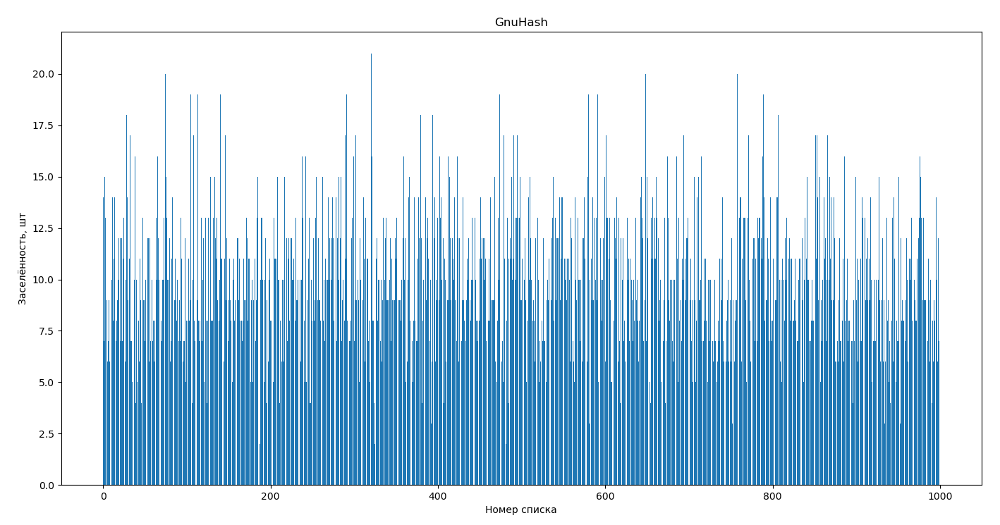
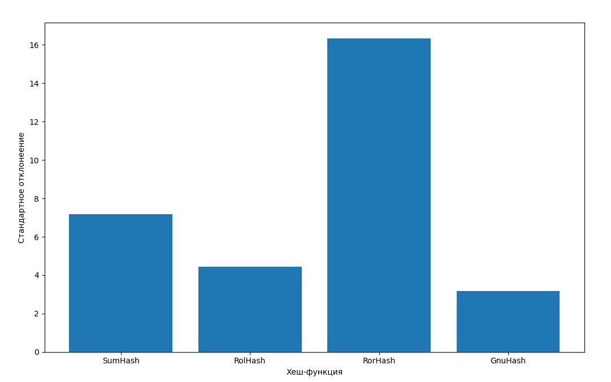

# Работа "Исследование и оптимизация поиска в хеш-таблице"

## Цели работы

- Изучить работу хэш-таблиц
- Сравнить работу различных хэш-функций
- Оптимизировать поиск элементов в хеш-таблице

## Теоретическая справка

**Хэш-функция** - функция, преобразующая входной массив данных в некоторую битовую строку по заданному алгоритму. Такое преобразование называется **хешированием**.

**Хэш-таблица** - структура данных, хранящая пары (ключ, значение), позволяющая выполнять 3 операции: добавление новой пары, удаление пары и поиск по ключу. Существуют 2 основных варианта хеш-таблиц: с открытой адресацией и со списками. В первом случае, таблица является массивом значений ``H``, во втором - массивом списков значений ``H``. К таблице привязана хеш-функция. Перед выполнением любой операции значение хешируется и результат: ``i = hash(key) % sizeof(H)`` является индексом в массиве ``H``. Операция добавления/поиска/удаления значения производится в соответствующей ячейке массива ``H[i]`` или в списке по индексу ``i``, в зависимости от варианта таблицы.

<kbd>
  
</kbd>

**Заселённость** - это число элементов, хранящееся в соотвествующем списке хеш-таблицы, (в реализации таблицы с массивом значений ``H``, заселённость каждой ячейки равна 1 и не имеет смысла).

**Коэффицент заполнения хеш-таблицы (α)** - число хранимых в таблице элементов, делённое на размер массива ``H`` - является важной характеристикой, от которой зависит время выполнения операций. В случае идеальной хеш-функции, равновероятно распределяющей значения по ключам, среднее время работы операции поиска элемента составляет ``Θ(1 + α)``.

## Оборудование и экспериментальная установка

### Машина

Все оптимизации и запуски программы производятся на ноутбуке **HP EliteBook 840 G8 3C6D0ES Evo i5-1135G7**.

### Инструменты

Профилирование программы производится при помощи инструмента ``--callgrind`` утилиты ``valgrind`` и с использованием просмотрщика ``kcachegrind``, а профилирование по времени при помощи библиотеки ``<time.h>``.

*Достойны упоминания*:
- Библиотеки ``re`` и ``random`` языка *Python*¹ используются для лексической обработки входного массива данных и формирования различных выборок данных.
- Библиотеки ``numpy``, ``pandas`` и ``matplotlib`` языка *Python*¹ используются для обработки больших массивов данных и построения графиков.

¹ - запрещён на территории РФ

### Структура данных

Измерения проводятся с хеш-таблицей, содержащей массив структур двухсвязных списков ``lists``, с типом данных ``const char*``:

```C
typedef const char* Value_t;            // тип данных элемента списка

struct HashTable                        // структура хеш-таблицы
{
    size_t n_words;
    size_t size;
    List*  lists;
    int (*hash_function)(const char*);
};
```

К ней также привязана функция хеширования ``hash_function``, чтобы не возникало ошибок добавления, поиска и удаления элементов. Структура ещё содержит размер массива списков ``size`` и суммарное число хранящихся в ней слов ``n_words``.

## Часть 1. Исследование хэш-фунцкий

Первая часть работы посвящена исследованию эффективности различных функций хэширования: от абсолютно неэффективных и бесполезных до часто используемых в алгоритмах хеширования.

### Методика исследования

Измерения проводились на массиве неповторяющихся слов. Для этого был выбран английский словарь², суммарно содержащий около 54000 слов. Его текст был подвергнут лексикографической обработке: при помощи модуля регулярных выражений ``re`` слова разделены, знаки препинания удалены, потворы убраны. Затем, при помощи модуля ``random`` из полученного массива случайным образом выбрано 10000 неповторяющихся слов. После этого хэш-таблица по-очереди заполняется значениями при помощи каждой из исследуемых функций. Производится спектральный анализ: для каждой таблицы я строю гистограмму заселённости, которая визуально отражает равномерность распределения элементов по спискам хеш-таблицы и позволяет оценить эффективность соответствующей хеш-функции.

² - взят с сайта https://www.softmaker.com/ru/dictionaries

### Хэш-функции и их спектральный анализ

Для исследования были выбраны нижеперечисленные функции. Каждая из них принимает на вход строку символов и возвращает её хеш в виде целочисленного значения.

#### ConstHash - постоянное значение

Функция выдаёт единственное, ранее определённое значение.

```C
int ConstHash(const char* value)
{
    return CONSTANT_HASH;
}
```

Заселённость хеш-таблицы с функцией ConstHash:

<kbd>
  
</kbd>

Недостатки этой функции очевидны, она никак не распределяет входные данные по спискам и не может быть применена в нашей задаче.

#### LenHash - длина строки

```C
int LenHash(const char* value)
{
    return (int)strlen(value);
}
```

Заселённость хеш-таблицы с функцией LenHash:

<kbd>
  
</kbd>

Немного лучше, однако на данном массиве данных функция неэффективна из-за ограниченности длины слов в языке, к тому же влияет распределение слов в английском языке. Так, например, слов длины 3-4 в английском словаре больше остальных. что влияет на неранвомерность рапсределения.

#### FirstSymbHash - первый символ

```C
int FirstSymbHash(const char* value)
{
    return (int)value[0];
}
```

Заселённость хеш-таблицы с функцией FirstSymbHash:

<kbd>
  
</kbd>

Показатели дисперсии и стандартного отклонения ещё уменьшились, но функция также является ограниченной, её результат всегда лежит в диапазоне от 0 до 255, к тому же на входном массиве английских слов она может принимать значения от 65 до 122 (английские буквы от A до z).

#### SumHash - контрольная сумма

```C
int SumHash(const char* value)
{
    int hash = 0;
    // size_t symbol_i = 0;
    size_t len = strlen(value);

    for (int index = 0; index < len; index++)
        hash += value[index];

    return hash;
}
```
Заселённость хеш-таблицы с функцией SumHash:

<kbd>
  
</kbd>

Функция работает уже сильно лучше, и действительно, контрольная сумма применяется уже гораздо чаще предыдущих хеш-функций, например, для проверки входного файла.

#### RolHash - циклический сдвиг влево

```C
static int ROL(int value, int offset)
{
    return (value << offset) | (value >> (32 - offset));
}

int RolHash(const char* value)
{
    int hash = 0;
    // size_t symbol_i = 0;
    size_t len = strlen(value);

    for (int index = 0; index < len; index++)
        hash = ROL(hash, 1) ^ value[index];
        // hash += 2;

    return hash;
}
```

Заселённость хеш-таблицы с функцией RolHash:

<kbd>
  
</kbd>

Чел харошшшш!

#### RorHash - циклический сдвиг вправо

```C
static inline int ROR(int value, int offset)
{
    return (value >> offset) | (value << (32 - offset));
}

int RorHash(const char* value)
{
    int hash = 0;
    // size_t symbol_i = 0;
    size_t len = strlen(value);

    for (int index = 0; index < len; index++)
        hash = ROR(hash, 1) ^ value[index];

    return hash;
}

```

Заселённость хеш-таблицы с функцией RorHash:

<kbd>
  
</kbd>

Казалось бы, функция похожа на предыдущую и должна давать тоже неплохой результат, однако её эффективность сложно противопоставить RolHash. Интересно...

#### GnuHash

```C
int GnuHash(const char* value)
{
    int hash = 5381;
    int len = strlen(value);

    for (int index = 0; index < len; index++)
        hash = hash * 33 + value[index];

    return hash;
}
```

Заселённость хеш-таблицы с функцией GnuHash:

<kbd>
  
</kbd>

Функция показала наилучшие результаты на данном массиве слов.

### Результаты измерений

Таким образом, различия в приведённых хеш-функциях видны и невооружённым взглядом из графиков, однако приведу сравнение некоторых статистических характеристик четырёх наиболее удачных хеш-функций:

Дисперсия:


Стандартное отклонение:


Нетрудно видеть, что наименьшие значения дисперсии и стандартного отклонения продемонстрировала функция GnuHash.

### Выводы

Таким образом, из представленных хеш-фукнций на наборе 10000 случайных слов из английского словаря была выявлена наиболее эффективная функция, и это **GnuHash**. Её и будем использовать во второй части исследования для более эффективной работы хеш-таблицы. Кроме того, стали видны явные недостатки функций FirstSymbHash и SumHash при большом размере хеш-таблицы, а именно, их ограниченность. Также выявлено неочевидное различие в работе RorHash и RolHash, из которых вторая оказывается менее эффективной в рамках нашей задачи.

## Часть 2. Оптимизация поиска в хэш-таблице

Задача второй части исследования состоит в оптимизации поиска элемента (ключ, значение) в хеш-таблице. Функция поиска принимает на вход ключ, считает его хеш при помощи той же хеш-функции, с которой таблица заполнялась, и проверяет наличие элемента в соответствующем списке.

### Методика измерений

Сначала была предпринята идея брать 10000 случайных слов из того же полного словаря и искать их в построенной ранее хеш-таблице. Измерения показывают, что выбранные при помощи python "случайные слова" из того же полного словаря имеют пересечение в около 20% (~1900-2100 слов из 10000 в пересечении) с массивом из первой части работы. Чтобы уравновесить число пересекающихся и непересекающихся слов, я изначально выберу из всего словаря 20000 слов, из которых уже затем буду выбирать случайные 10000 слов для заполнения таблицы и 10000 слов для поиска в ней. Измерения показывают, что при этом процент пересечения этих множеств составляет около 50% (~4900-5100 из 10000 слов в пересечении), что больше подходит для эксперимента.

### Выявление лимитирующих факторов

Проведя описанные действия и воспользовавшись утилитой ``valgrind --callgrind`` и просмотрщиком ``kcachegrind`` для выявления узких мест программы были получены следующие результаты. Чтобы увеличить вклад функции поиска и при профилировании программы явно видеть ресурсы, которые она использует, выявить лимитирующие факторы её работы, я запускаю цикл поиска слов из массива в хеш-таблицы 200 раз.

### Непотимизированная версия программы

### Оптимизация 1: <Флаги компилятора>

Воспользуемся возможностями, которые предоставляет нам компилятор, а именно - используем флага оптимизации -O3, который уже ранее показал свою эффективность в предыдущих задачах.

|Время работы           |   |
|:----------------------|:-:|
|Абсолютное ускорение   |   |
|Относительное ускорение|   |

### Оптимизация 2: <Математические принципы хеш-таблицы>

У хеш-таблицы есть несколько доказанных математических принципов, строго доказанных. Максимальная производительность может быть достигнута при размере, являющимся простым числом, при этом таком, чтобы средняя длина списка составляла 1.5 элемента. То есть количество списков в таблице я изначально выберу в зависимости от колчиества слов, равное 6673 - простое число. Производительность программы поиска при этом возрастёт в разы:

|Время работы           |   |
|:----------------------|:-:|
|Абсолютное ускорение   |   |
|Относительное ускорение|   |

### Оптимизация 3: <AVX2-инструкции сравнения>

Профилирование программы даёт понять, что наиболее узким местом работы является инструкция strcmp_avx2, оптимизируем её, используя intrinsic-инструкции.

|Время работы           |   |
|:----------------------|:-:|
|Абсолютное ускорение   |   |
|Относительное ускорение|   |

### Оптимизация 4: <Ассемблерная функция хеширования>

Попробуем заменить С функцию хеширования GnuHash на написанную на ассемблере функцию.

|Время работы           |   |
|:----------------------|:-:|
|Абсолютное ускорение   |   |
|Относительное ускорение|   |

### Оптимизация 5: <Аппаратная функция хеширования>

В возможности моего процессора входит инструкция, выполняющаяся над вектором данных - криптографическая хеш функция ... crc32 ... Преимущество в том,что инструкция реализована аппаратурно, а значит, занимает малое количество тактов, однако из недостатков - она может оказаться неприменимой для других версий процессоров. Используем её вместо GnuHash. Функция имеет такое распределение:

А результат измерений времени после замены представлен в таблице:

|Время работы           |   |
|:----------------------|:-:|
|Абсолютное ускорение   |   |
|Относительное ускорение|   |

### Выводы

Таким образом!

### Литература

CRC32 hash algorithm: https://soltau.ru/index.php/themes/dev/item/461-kak-
